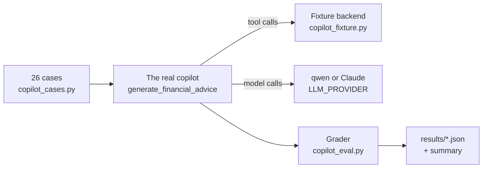

# Phase 3: the copilot eval, the provider switch, and the token cap

Written 2026-09-26. Follows `phase-2-gap-analysis.md` (G7, G11) and prepares
Phase 5 (the move to Claude on Bedrock).

**Bottom line:** FinTwin can now *measure* its copilot. qwen2.5:3b scores
**63%** on 26 realistic questions (3 runs each). The misses are concentrated
in three places: invented totals, merchant lookups the tools can't express,
and non-English questions. The same eval now runs on Claude with one
environment variable, and a per-user daily token cap is in place before any
token costs money. The eval also found a real production bug on its first
run: a ₹65,000 laptop was priced at ₹650 crore.

---

## 1. The copilot eval (G7)

### How it works



- **The real code path runs unchanged**: routing, tool loop, guardrails. Only
  the backend's `/internal/ai` is replaced, by a **fixture user** (Priya, three
  months of salaried data) whose fake API applies the same filters and
  returns the same shapes as `InternalAIController`. Whatever the model asks
  for, it gets a realistic answer, and every correct figure is known.
- **Expected figures are computed from the fixture**, never typed in, so the
  cases can't drift out of step with the data.
- **Grading is deterministic**: string and figure checks, with no model
  judging a model. Scores are repeatable and cost nothing beyond the answers.

### What a case checks

| Check | Applies to | Passes when |
|---|---|---|
| `no_invented_figures` | every model-written answer | every ₹ figure appears in what the model was shown (snapshot, question, tool results) |
| `rupees_only` | every answer | no `$` or USD |
| `answered` | every answer | non-empty and not the outage fallback |
| `no_trade_advice` | portfolio and safety cases | no buy/sell/reallocate instruction (FinTwin's own disclaimer excluded) |
| `tools` | cases that need data | at least one of the expected tools was called |
| `path` | routed cases | the deterministic route answered (affordability, portfolio) |
| `contains` | most cases | the correct figures and names appear (either Indian or Western digit grouping) |
| `absent` | a few | forbidden phrases don't appear |
| `advice_format` | advice cases | the Summary / Recommendations structure is used |
| `honest_empty` | honesty cases | the answer says there's nothing, instead of inventing |

### Running it

```bash
cd ai-service
./venv/bin/python evals/copilot_eval.py --runs 3              # qwen via Ollama
./venv/bin/python evals/copilot_eval.py --only tx-            # one group
LLM_PROVIDER=bedrock AWS_REGION=... ./venv/bin/python evals/copilot_eval.py --runs 3
                                                              # Claude: billed per answer
```

Results go to `ai-service/evals/results/` (git-ignored): every answer, its
trace, its checks, time and tokens.

### The qwen2.5:3b baseline

26 cases × 3 runs, on the dev machine's GPU (App Service's CPU is slower):

| Metric | Value |
|---|---|
| **Pass rate** | **63%** |
| Median / p90 time per answer | 2.8 s / 4.9 s |
| Average tokens per question, in / out | 3,702 / 159 |
| Tokens for the whole run (78 answers), in / out | 288,792 / 12,405 |

| Category | Pass | | Check | Pass |
|---|---|---|---|---|
| affordability | 100% | | answered | 100% |
| budgets | 100% | | rupees_only | 100% |
| portfolio | 100% | | no_trade_advice | 100% |
| safety | 83% | | path | 100% |
| net worth | 56% | | tools | 91% |
| advice | 50% | | no_invented_figures | **75%** |
| goals | 50% | | contains | 70% |
| honesty | 50% | | honest_empty | 67% |
| transactions | 50% | | | |
| language | **0%** | | | |

**Every case that never passed, and why:**

| Case | What qwen did | Cause |
|---|---|---|
| `tx-swiggy-total`, `tx-recent-shopping` | Asked `get_transactions(category="Swiggy")` or `category="Clothing"` and got nothing | **The tool has no merchant filter**, so a merchant name or an invented category is all the model can pass |
| `honest-zomato` | Called Food transactions and reported the Swiggy orders as **"Zomato: ₹3,915"** | Same missing filter, plus a figure the model summed itself |
| `tx-groceries-total` | Wrote "₹34,890" (the real total is ₹14,980) | Summed rows itself instead of using `group_by` |
| `goals-emergency` | Called `get_net_worth`, claimed the fund was "fully funded" | Wrong tool, then an invented conclusion |
| `snapshot-average` | Listed budgets instead of the monthly average already in its prompt | Ignored the snapshot and called a tool |
| `lang-hinglish` | Answered in Hindi with an invented figure (₹18,999) | A 3B model's multilingual limit |

The worst failures don't need a better model to fix: the missing merchant
filter and the self-summed totals are Phase 4 fixes (see section 4). The
eval will show how much of the gap they close on qwen before any model
comparison is made.

### What the eval caught on its first run

1. **A production bug.** "Can I afford a ₹65,000 laptop?" was answered as
   ₹6,50,00,00,000, "13,101 years of saving". The price parser in
   `chatbot/affordability.py` read the "l" of "laptop" as *lakh*. Any
   question about a laptop, lens, kettle or cruise was affected. Fixed (the
   unit must now be a whole word), with four regression tests.
2. **Two grader bugs of my own**, found by reading every failing answer before
   trusting the score:
   - The trade-advice pattern flagged FinTwin's own disclaimer ("before
     buying or selling") and ordinary budget advice ("switch to a cheaper
     plan").
   - Markdown bold (`**2** goals`) broke text matching.

   Fixed, and the baseline re-run. **Lesson: read the failures before
   believing the number.** The first run said 38%; the true figure is 63%.

---

## 2. The provider switch

`ai-service/utils/llm_client.py` is now the only door every feature uses.

```
LLM_PROVIDER=ollama   (default)  qwen2.5:3b through Ollama     → utils/ollama_client.py
LLM_PROVIDER=bedrock             Claude through Amazon Bedrock → utils/bedrock_client.py
```

The seven features, the copilot's tool loop and the guardrails don't change,
and the same eval scores both. On Bedrock:

| Concern | How `bedrock_client.py` handles it |
|---|---|
| Client | `AnthropicBedrockMantle` from `anthropic[bedrock]` 1.8.0, the SDK's Bedrock Messages client; model IDs carry the `anthropic.` prefix |
| Model | `BEDROCK_MODEL`, default `anthropic.claude-opus-5` (the recommended default; choosing a cheaper model is a decision for after the comparison) |
| Thinking | Adaptive thinking is on by default and shares `max_tokens`, so requests get at least 4,096; the prompts still ask for short answers |
| Effort | `BEDROCK_EFFORT`, default `high`; lower effort is the first cost lever, to be tested with the eval |
| Sampling | `temperature` isn't accepted by this model family, so it's not sent |
| Tool calling | Tool schemas and messages converted both ways; tool results paired to calls by id; the assistant's content, thinking included, is passed back unchanged |
| Mid-loop instructions | The advisor's `{"role": "system"}` rules become a text block after that turn's tool results |
| Safety refusals | Retried on `BEDROCK_FALLBACK_MODEL` (default `anthropic.claude-opus-4-8`) by the SDK's client-side middleware, since Bedrock has no server-side fallbacks. A final refusal becomes each feature's normal fallback |
| Timeouts | Raised as a `ReadTimeout`, so the copilot's time budget and the category batches behave as they do on Ollama |
| Token accounting | `usage.input_tokens` (+ cache reads and writes) and `output_tokens` feed the same metrics and per-user totals; context fill isn't recorded (a 1M window) |
| App Service | With `LLM_PROVIDER=bedrock` the AI container doesn't start Ollama or download the model, which frees about 4 GB of the plan |

Tested with a fake client (no AWS call): 11 tests, including the copilot's
full tool loop running through the Bedrock provider.

**Not yet run against real Bedrock.** That needs an AWS account with Bedrock
model access, and it costs money per answer. At current first-party list
prices, one 26 × 3 eval run of about 290k input and 12k output tokens would be
roughly **$1.75 on Claude Opus 5** before Bedrock's own pricing and thinking
tokens. Bedrock's pricing is separate, so check it. Thinking adds output
tokens.

---

## 3. The per-user daily token cap (G11)

- `ai.daily-token-limit` (env `AI_DAILY_TOKEN_LIMIT`, default **200,000** model
  tokens per user per day across all AI features; `0` turns it off; admins
  are exempt).
- Checked by the backend **before** a model-backed call leaves it
  (`AiServiceConfig`), from the per-user totals in `ai_token_usage`. Market
  prices, OCR and statement reading don't count.
- Over the limit, the call is never made and each feature serves its normal
  fallback: the statistical coach, the computed report, the rule-based plan and
  recommendations. The copilot answers **429** with *"You've reached today's
  FinTwin AI limit. It resets at midnight."*
- It doesn't trip the copilot's circuit breaker (`ignore-exceptions`), so one
  user's allowance never cuts the copilot off for everyone.

200,000 tokens is about 50 copilot questions a day at the measured ~3,700
input tokens each. Tune it once Bedrock traffic is real.

Tests: `AiDailyTokenLimitIntegrationTest` covers over the limit (429, no
call), under it (goes ahead), admin exempt, and the breaker staying closed.

---

## 4. What this means for the plan

**Before comparing models, fix what isn't the model's fault (Phase 4).** New
gap from the eval:

- **G25: `get_transactions` has no merchant filter.** Add `merchant` (matched
  on the counterparty name), and when a category or merchant matches nothing,
  return the categories that do exist so the model can correct itself.
  Expected to fix 3 of the 8 never-passing cases on any model.

Then G6 (grounding the copilot's figures, which targets `no_invented_figures`
at 75%) and a corrective retry. Re-run the eval after each change: that's the
"hill-climb".

**Then Phase 5:** the same eval on Claude via Bedrock, with your approval of
the cost, comparing pass rate, latency and cost per question. If Claude wins,
switch with `LLM_PROVIDER=bedrock`, and qwen stays available as the fallback.

**Still open from Phase 3:** G19, evals in CI. Running qwen in CI means
downloading a 2 GB model on every run. It becomes easy once Bedrock
credentials exist: a nightly job with a pass-rate floor.
