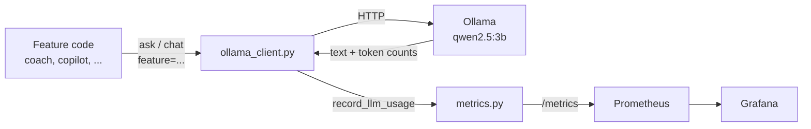
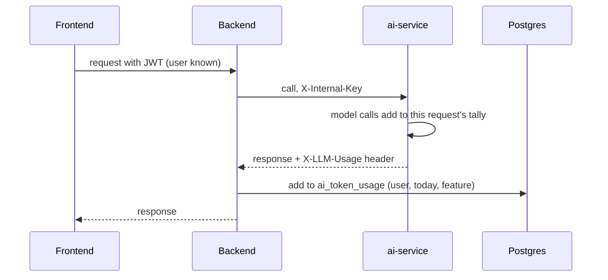

# Token usage metrics for FinTwin's AI service

2026-09-24

FinTwin now counts every token qwen2.5:3b reads and writes, per AI feature, and exposes the totals to Prometheus. Before this change, Ollama sent back exact token counts with every response and `ai-service/utils/ollama_client.py` threw them away.

## Why track tokens on a free model

FinTwin runs qwen on its own VM through Ollama, so no bill or quota exists to run out of. Tokens still cost three real things:

| Cost | Why it matters for FinTwin |
| --- | --- |
| CPU time | More tokens means a slower answer, and the Spring backend hangs up at 20 s. |
| Capacity | One VM generates a fixed number of tokens per second, shared by every user. |
| Context window | Each call has a fixed window (`num_ctx` 2048 or 4096). If a prompt overflows it, Ollama silently drops the start of the prompt, where the rules are. |

The old code only guessed prompt size as characters ÷ 3. It had no view of actual usage per feature, generation speed, or how close prompts ran to the window.

## Token basics

A token is the unit a model reads and writes: a word, part of a word, or punctuation. Roughly 1 token is about 3–4 characters of English, and fewer characters for numbers like ₹12,450.

| Term | Meaning | Ollama field |
| --- | --- | --- |
| Input (prompt) tokens | Everything sent in: rules, user data, chat history, tool results | `prompt_eval_count` |
| Output tokens | What the model writes back, capped by `num_predict` | `eval_count` |
| Generation time | Time spent producing the output, in nanoseconds | `eval_duration` |
| Context window | The maximum tokens one call can hold, input and output together | `num_ctx` (set by FinTwin) |

Tokens per second is the model's speed on this hardware, and context fill is how full the window was when the model started writing:

```
tokens/s = eval_count / (eval_duration / 1e9)
fill     = prompt_eval_count / num_ctx
```

In Java terms, the Prometheus client used here plays the same role as Micrometer behind Spring's `/actuator/prometheus`. A `Counter` only goes up, and a `Histogram` sorts each observation into buckets, like a Micrometer `DistributionSummary`.

## What changed

Eight files in `ai-service` changed, plus one new test file. The work splits into three parts: new metrics, recording in the Ollama client, and a feature label at every call site.



The token counts travel back with the text on every call. `ollama_client.py` now passes them to `metrics.py` before returning the text.

### 1. New metrics in `utils/metrics.py`

| Metric | Type | Labels | Answers |
| --- | --- | --- | --- |
| `fintwin_ai_llm_calls_total` | Counter | feature | How many model calls each feature makes |
| `fintwin_ai_llm_tokens_total` | Counter | feature, direction (input / output) | How many tokens each feature uses |
| `fintwin_ai_llm_tokens_per_second` | Histogram | feature | How fast the model generates on this box |
| `fintwin_ai_llm_context_fill_ratio` | Histogram | feature | How close prompts come to overflowing `num_ctx` |

A new function, `record_llm_usage(feature, body, num_ctx)`, reads the Ollama response and updates all four:

```python
prompt_tokens = int(body.get("prompt_eval_count") or 0)
output_tokens = int(body.get("eval_count") or 0)
eval_ns = int(body.get("eval_duration") or 0)

LLM_CALLS.labels(feature=feature).inc()
LLM_TOKENS.labels(feature=feature, direction="input").inc(prompt_tokens)
LLM_TOKENS.labels(feature=feature, direction="output").inc(output_tokens)
if output_tokens and eval_ns:
    LLM_TOKENS_PER_SECOND.labels(feature=feature).observe(output_tokens / (eval_ns / 1e9))
if prompt_tokens and num_ctx:
    LLM_CONTEXT_FILL.labels(feature=feature).observe(prompt_tokens / num_ctx)
```

### 2. Recording in `utils/ollama_client.py`

`ask()` and `chat()` each take a new keyword argument, `feature="other"`. They keep the whole response body instead of pulling out only the text, record usage, then return exactly what they returned before:

```python
body = response.json()
record_llm_usage(feature, body, num_ctx)
return body["response"].strip()
```

`chat()` used to hard-code `num_ctx: 4096` inside the payload. It is now a local variable, so the payload and the fill ratio use the same number.

### 3. A feature label at every call site

| Feature label | File | Call |
| --- | --- | --- |
| `copilot` | `chatbot/advisor.py` | `chat()` in the tool-calling loop |
| `advisor` | `chatbot/advisor.py` | `ask()` for structured advice |
| `coach` | `spending_coach/coach_engine.py` | `ask()` |
| `goal_plan` | `chatbot/goal_planner.py` | `ask()`, including retries |
| `report` | `chatbot/report_generator.py` | `ask()` |
| `category_suggest` | `categories/suggest.py` | `ask()`, once per batch |
| `investments` | `investments/recommendation_engine.py` | both `ask()` calls: portfolio and summary |

A call without a label, or with a label not in the list, is counted as `other`.

### 4. Tests

The new file `tests/test_llm_usage_metrics.py` has 7 tests. Ollama is mocked at the HTTP layer. They check token counts per feature, tokens per second (100 tokens in 5 s = 20), context fill (1024 of 2048 = 0.5; `chat()` against 4096 = 0.25), missing counts, unknown labels, and that a malformed body never raises.

## Design decisions

| Decision | Why |
| --- | --- |
| Label by feature, never by user | Every distinct label value creates a new time series. One series per user grows Prometheus without limit. Per-user totals belong in the database. |
| A fixed list of features, anything else becomes `other` | Keeps the number of series known and small, even if a caller passes a typo. |
| `record_llm_usage` catches every exception | Metrics must never break the feature they measure. A bad response body is logged at debug level and the user still gets an answer. |
| Skip context fill when `prompt_eval_count` is missing | Ollama can omit or lower the count when it reuses a cached prompt prefix. Recording 0 would drag the distribution down and hide real overflow risk. |
| Pre-create every label at import | A counter with no increments yet doesn't appear in `/metrics`, which breaks `rate()` on a fresh start. The existing coach and goal-plan metrics follow the same rule. |
| Fill buckets 0.25, 0.5, 0.75, 0.9, 1.0 | The top two buckets are the danger zone: at 0.9 or above, little room is left for the output, and near 1.0 the start of the prompt may already be cut off. |
| Speed buckets 2.5 to 150 tokens/s | The dev machine (RTX 3050 laptop GPU) measured about 70–80 tokens/s. A CPU-only VM will be much slower, so the buckets cover both. |
| `feature` is a keyword argument with a default | Existing callers and test mocks keep working unchanged, so none of the 367 existing tests needed edits. |

One caveat: in the copilot's multi-turn tool loop, Ollama may reuse the cached earlier turns, so `input` tokens for `copilot` can undercount the full conversation size. Output tokens are always exact.

## How it was verified

The full ai-service suite passes: 374 tests, including the 7 new ones.

```bash
cd ai-service && venv/bin/python -m pytest -q
# 374 passed
```

A live call to qwen2.5:3b on the dev machine, one `ask()` labelled `advisor` and one `chat()` labelled `copilot`, recorded these values:

| Feature | Input tokens | Output tokens | Tokens/s | Context fill |
| --- | --- | --- | --- | --- |
| advisor | 39 | 26 | 69.1 | 1.9% of 2048 |
| copilot | 36 | 4 | 78.8 | 0.9% of 4096 |

To see the metrics on a running ai-service:

```bash
curl -s -H "Authorization: Bearer $METRICS_TOKEN" localhost:8000/metrics | grep fintwin_ai_llm
```

`/metrics` needs `METRICS_TOKEN` (local compose defaults it to `local-dev-metrics-token`). Without the token it answers 401, and with no token configured at all it answers 404.

### Useful PromQL queries

| Question | Query |
| --- | --- |
| Tokens per minute, by feature | `sum by (feature) (rate(fintwin_ai_llm_tokens_total[5m])) * 60` |
| Output tokens today, by feature | `sum by (feature) (increase(fintwin_ai_llm_tokens_total{direction="output"}[24h]))` |
| Average tokens per call | `sum by (feature) (rate(fintwin_ai_llm_tokens_total[1h])) / sum by (feature) (rate(fintwin_ai_llm_calls_total[1h]))` |
| Median speed (tokens/s) | `histogram_quantile(0.5, sum by (le) (rate(fintwin_ai_llm_tokens_per_second_bucket[15m])))` |
| Share of calls over 90% of the context window | `1 - sum by (feature) (rate(fintwin_ai_llm_context_fill_ratio_bucket{le="0.9"}[1h])) / sum by (feature) (rate(fintwin_ai_llm_context_fill_ratio_count[1h]))` |

## Grafana dashboard

The dashboard **FinTwin.ai — AI Token Usage** (uid `fintwin-ai-tokens`) lives in `ops/grafana/dashboard-json/ai-tokens.json`. Grafana provisions it into the FinTwin folder at `localhost:3001` when the compose stack starts.

| Row | Panels |
| --- | --- |
| Top stats | Output tokens, input tokens and model calls in the selected range; share of calls over 90% of the context window (orange above 1%, red above 5%) |
| Tokens by feature | Output and input tokens per minute (stacked, so the top line is total load); average input and output tokens per call |
| Speed | Median and slowest-10% tokens/s; median tokens/s per feature |
| Context window | 95th-percentile context fill per feature, with a red line and area at 90% |
| Busiest hours | Model calls per hour by feature, and output tokens per hour, as bars over the last 7 days |

The hourly bars need at least one full clock hour of data before the first bar appears.

The mount that pointed at the deleted `k8s/monitoring/fintwin-dashboard.json` was also fixed. When Docker bind-mounts a missing file, it creates an empty directory in its place, so that dashboard had silently disappeared. The old production dashboard (HTTP, logins, HikariCP, JVM and more) was restored from git into `ops/grafana/dashboard-json/fintwin.json`. `docker-compose.yml` now mounts the whole `ops/grafana/dashboard-json/` directory, so a new dashboard only needs a JSON file dropped there.

Both were verified on 2026-09-24 against a throwaway Prometheus and Grafana 10.4.0 fed with generated traffic. Both dashboards were provisioned, all 17 panel queries returned data, and the rendered dashboard was checked in a screenshot.

## Per-user usage on the admin page

Prometheus only knows features, never users. Per-user totals live in the database and appear on the admin page, under the **AI Usage** tab.



| Piece | Where | What it does |
| --- | --- | --- |
| Per-request tally | `ai-service/utils/llm_usage.py` | A context variable, filled by `record_llm_usage` on every model call |
| Response header | `ai-service/app.py`, middleware `report_llm_usage` | Returns the tally as `X-LLM-Usage: {"coach":{"in":812,"out":143,"calls":1}}` |
| Interceptor | `backend/.../config/AiServiceConfig.java` | Every ai-service RestTemplate hands the header to `AiTokenUsageService.record` |
| Storage | `V23__ai_token_usage.sql` | One row per user, feature and day; upserted, so the table stays small |
| Attribution | `AiTokenUsageService.record` | The logged-in user from the security context; runs in its own transaction, so it works inside read-only requests and never fails the AI call |
| Admin API | `GET /api/v1/admin/ai-usage?days=30&limit=100` | Needs the ADMIN role plus `READ_ALL_USERS`; returns totals, per feature, per day and per user with each user's per-feature split |
| Admin UI | `frontend/src/components/admin/AdminAiUsage.jsx` | Stat cards, per-feature bars, tokens per day, and a users table (heaviest first); selecting a user opens their per-feature split |

Only counts are stored, never prompt or answer text. Deleting an account deletes its usage (`ON DELETE CASCADE`). Every AI call today runs on the user's own request thread; a future call from a scheduled job would have no user and would not be counted.

Tests: 5 ai-service tests for the header (sync and async routes, no leaks between requests), 6 backend integration tests on real Postgres (upsert, read-only transaction, bad headers, the real RestTemplate against a stub server, the admin response, 403 for a normal user), and 3 frontend tests.

## Next steps

- [x] Build a Grafana dashboard for these metrics: tokens by feature over time, speed, context fill against a 90% warning line, busiest hours.
- [x] Fix the broken Grafana mount: `docker-compose.yml` still mounted `k8s/monitoring/fintwin-dashboard.json`, which was deleted with `k8s/`.
- [x] Production monitoring on Azure App Service: Grafana Cloud's free tier scrapes the backend and AI service with `METRICS_TOKEN`, and the same 8 alert rules run there and locally. Setup is in `docs/azure-app-service-deployment.md`, "Monitoring".
- [x] Per-user token totals in the database, shown on the admin page's AI Usage tab (see above).
- [ ] Use these same metrics to compare speed and token use when FinTwin's own fine-tuned model runs next to qwen.

For the fine-tuning plan: this machine has an RTX 3050 laptop GPU with 4 GB of memory. That is enough to run qwen2.5:3b, but too little to fine-tune a 3B model, so training will need a rented GPU.
